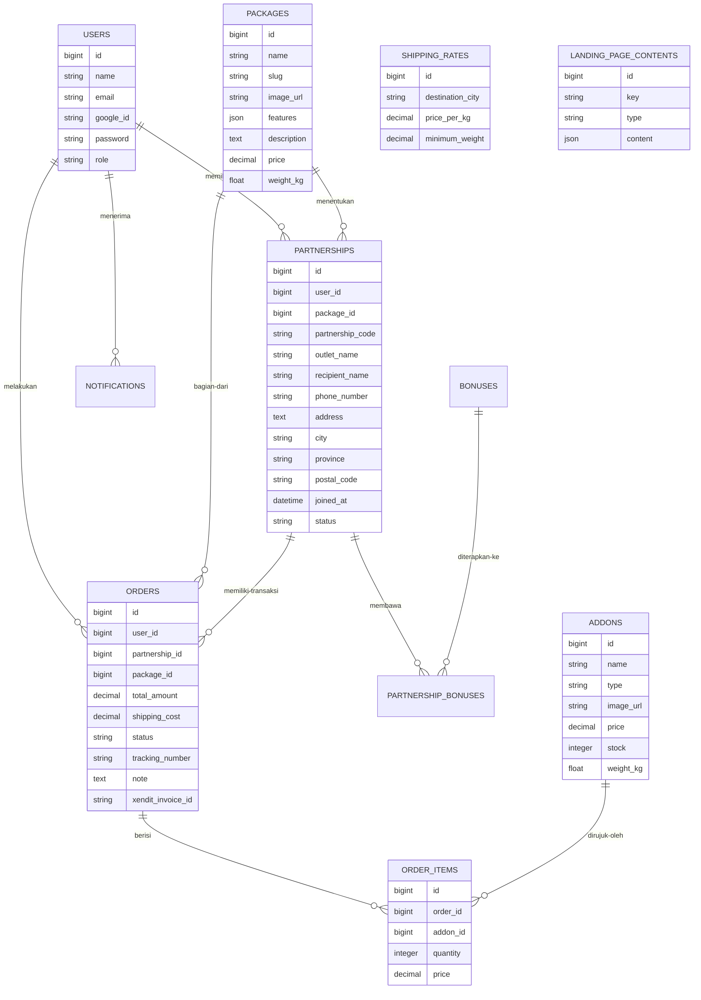

# Rencana: Website Kemitraan & Dashboard RCGO

Rencana ini merangkum arsitektur dan implementasi teknis untuk Website Kemitraan RCGO (Remote Control Car). Sistem ini akan menangani penjualan paket kemitraan, pemilihan add-on (mobil, lintasan, aksesoris), integrasi pembayaran Xendit, dan pengiriman otomatis.

## Tinjauan Pengguna Diperlukan

> [!IMPORTANT]
> **Kredensial Xendit**: Anda perlu menyediakan API Key Xendit (Development/Production) agar gerbang pembayaran dapat berfungsi.
> **Google OAuth**: Kita perlu menyiapkan Google Cloud Project untuk fungsi SSO (Single Sign-On).

## Perubahan yang Diusulkan

### 1. Desain Skema Database (Migrasi Laravel)

Kami akan menggunakan skema yang mendukung pesanan kompleks dengan add-on dan sistem pengiriman berbasis berat.

### 2. Sistem Dual Dashboard (FilamentPHP)

Untuk pengembangan cepat dan tampilan modern, kita akan menggunakan **FilamentPHP**.

#### A. Dashboard Admin
- **Manajemen Produk**: CRUD untuk Paket dan Add-on (termasuk upload gambar & berat).
- **Manajemen Landing Page**: Kontrol visual untuk mengubah teks Hero, gambar slider, fitur unggulan, dan galeri RCGO tanpa coding.
- **Logistik**: Upload CSV untuk daftar harga ongkir Indah Cargo.
- **Transaksi**: Memantau status pembayaran Xendit, input resi, dan detail pesanan.
- **Kemitraan**: Mengelola data Mitra, Alamat, dan status akun.
- **Bonus**: Membuat bonus baru yang bisa didapatkan Mitra saat pembelian.

#### B. Dashboard Mitra (User)
- **Portal Pembelian**: Membeli paket kemitraan baru dengan pemilihan add-on dinamis.
- **Manajemen Alamat**: Menambah atau mengedit alamat pengiriman/penerima.
- **Status Kemitraan**: Melihat daftar kemitraan yang dimiliki dan bonus yang masih aktif (beserta masa berlakunya).
- **Riwayat Pesanan**: Melacak status pesanan dan pembayaran.

### 3. Sistem Pengiriman (Indah Cargo)

- **Pelacakan Berat**: Setiap Paket dan Add-on memiliki field `weight_kg`. Total berat dihitung otomatis saat checkout.
- **Logistik CSV**: Admin dapat mengunggah file CSV berisi `destination_city`, `price_per_kg`, dan `minimum_weight`.
- **Kalkulasi Otomatis**: 
  - `Total Berat = Berat Paket + Total(Berat Add-on * Qty)`
  - `Ongkos Kirim = Harga per Kg (dari CSV) * Total Berat`.
- **Status & Resi**:
  - **Status Pesanan**: `Menunggu Pembayaran`, `Dibayar` (Otomatis via Xendit), `Dikemas`, `Dikirim`, `Selesai`.
  - **Input Resi**: Admin menginput nomor resi Indah Cargo saat status berubah menjadi `Dikirim`.
  - **Pelacakan Mitra**: Mitra dapat melihat status terkini dan nomor resi langsung dari Dashboard Mitra.

### 4. Logika Backend (Laravel 11)

- **Autentikasi**: Google SSO (Socialite) dan Registrasi Manual dengan verifikasi email.
- **Pembayaran (Xendit)**: Integrasi API Invoice dan Webhook untuk pembaruan status pesanan otomatis setelah pembayaran sukses.
- **Notifikasi**: Email otomatis untuk Registrasi, Pesanan Baru, dan Pembayaran Berhasil menggunakan sistem Queue agar performa tetap cepat.

### 5. Frontend Landing Page (Dinamis)

- **Manajemen Konten (CMS)**: Halaman depan tidak lagi statis. Admin dapat mengubah teks Hero, Deskripsi Kemitraan, dan Galeri melalui dashboard.
- **Visual Premium**: Desain modern menggunakan TailwindCSS dengan animasi halus dan gambar resolusi tinggi dari produk RCGO.
- **Interaktivitas**: Form pemilihan add-on yang secara instan menghitung total harga dan ongkos kirim sebelum pengguna melakukan checkout.

### 6. Fase Implementasi (Linimasa)

Pengerjaan akan dibagi menjadi 5 fase utama untuk memastikan stabilitas setiap fitur:

| Fase | Fokus | Pekerjaan Utama |
|---|---|---|
| **Fase 1** | **Fondasi & Auth** | Setup Laravel, Filament, Migration Database, Integrasi Google SSO. |
| **Fase 2** | **Master Data & CMS** | Dashboard Admin (Paket, Add-on, CSV Ongkir, CMS Landing Page). |
| **Fase 3** | **Alur Checkout** | Keranjang belanja, Add-on selector, Hitung Ongkir, Integrasi Checkout Xendit. |
| **Fase 4** | **Fitur Logistik & Bonus** | Dashboard Mitra, Manajemen Alamat, Input Resi Admin, Sistem Bonus Otomatis. |
| **Fase 5** | **Testing & Polish** | Integrasi Email, Testing Webhook Xendit, Perbaikan UI & Optimasi Kecepatan. |

---

## Rencana Verifikasi

### Tes Otomatis
- **Pest/PHPUnit**: 
  - Unit test untuk kalkulasi harga dan ongkir.
  - Mocking API Xendit untuk memastikan webhook berfungsi.

### Verifikasi Manual
1. Registrasi via Google SSO.
2. Tambahkan alamat pengiriman di Dashboard Mitra.
3. Pilih Paket Kemitraan dan tambahkan Add-on (mobil, baterai, dll).
4. Verifikasi apakah ongkir muncul otomatis berdasarkan kota tujuan.
5. Bayar melalui Xendit Sandbox.
6. Cek apakah email notifikasi diterima dan Dashboard Admin mencatat transaksi sukses.
